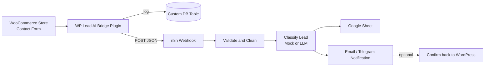

# WP Lead AI Bridge

A working demo that connects a WordPress/WooCommerce store to an AI automation pipeline: every lead submitted through the site's contact form is logged, forwarded to n8n, classified by an LLM, and routed to a spreadsheet and a notification — automatically, with no manual work.

This is a self-directed portfolio project built to demonstrate WordPress development combined with AI automation. It is not a client project; no client data or testimonials are used.

## Architecture

```
 [WooCommerce Store + Contact Form]
              |
              v
 [WP Lead AI Bridge plugin]
   - validates + sanitizes input
   - logs to a custom DB table
   - forwards JSON to n8n webhook
              |
              v
        [n8n Webhook]
              |
              v
   [Validate & Clean (Function)]
              |
              v
  [Classify Lead: type, urgency,
   suggested reply (Mock or LLM)]
             / \
            /   \
           v     v
  [Google Sheet]  [Email / Telegram
   (lead record)   notification]
```



## Why it matters

Most junior WordPress developers can build a site. Fewer can make the site *do something* after a lead comes in — automatically triage it, log it, and get the right person notified with useful context instead of a raw form email. That's the gap this project closes: it pairs core WordPress/WooCommerce skills with a real automation pipeline (webhooks, REST APIs, and an LLM classification step), the same pattern used in production lead-routing and support-triage systems.

## What's in this repo

| Path | What it is |
|---|---|
| `wp-lead-ai-bridge.php` | The WordPress plugin: settings page, DB log table, CF7/WPForms hooks, public REST endpoint, admin log viewer |
| `includes/class-lead-log-list-table.php` | Native wp-admin table (`WP_List_Table`) that displays every logged submission |
| `n8n-workflow/lead-ai-pipeline.json` | Importable n8n workflow — webhook, validation, mock/LLM classification, Google Sheets + email branches |
| `SETUP.md` | Step-by-step setup, from a blank XAMPP install to a live tested pipeline |

## Fails gracefully, on purpose

If n8n is offline or the webhook URL is wrong, the form's own email still sends (the plugin only adds a side effect after the form plugin has already done its job), and the log records exactly what went wrong instead of failing silently. This was tested by stopping n8n mid-demo and confirming the site kept working.

## Screenshots

*(placeholders — replace with real screenshots once the live demo is up)*

- `screenshots/lead-log.png` — the admin Lead Log table
- `screenshots/n8n-workflow.png` — the workflow canvas in n8n
- `screenshots/sheet-output.png` — a classified lead landing in Google Sheets

## Watch it run

*(placeholder — will embed a short Loom walkthrough here: submitting a lead on the live site, then switching to n8n and the Google Sheet to show it arriving classified in real time)*

`[Loom link goes here]`

## Stack

WordPress, WooCommerce, Elementor, Contact Form 7 / WPForms, PHP, MySQL, WordPress REST API, n8n, LLM (OpenAI-compatible), Google Sheets.
